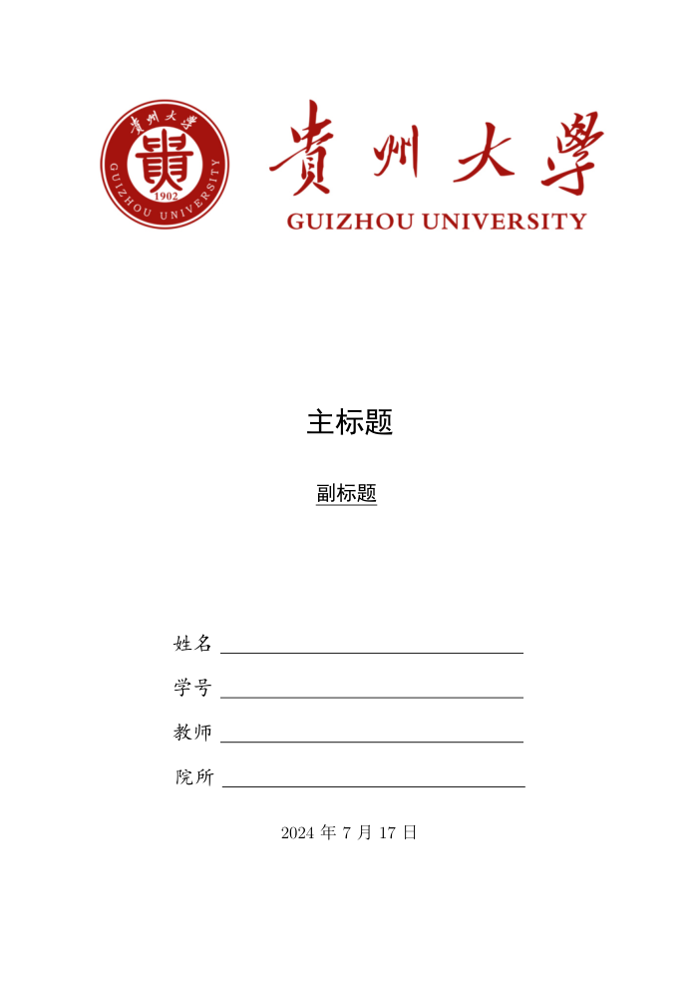
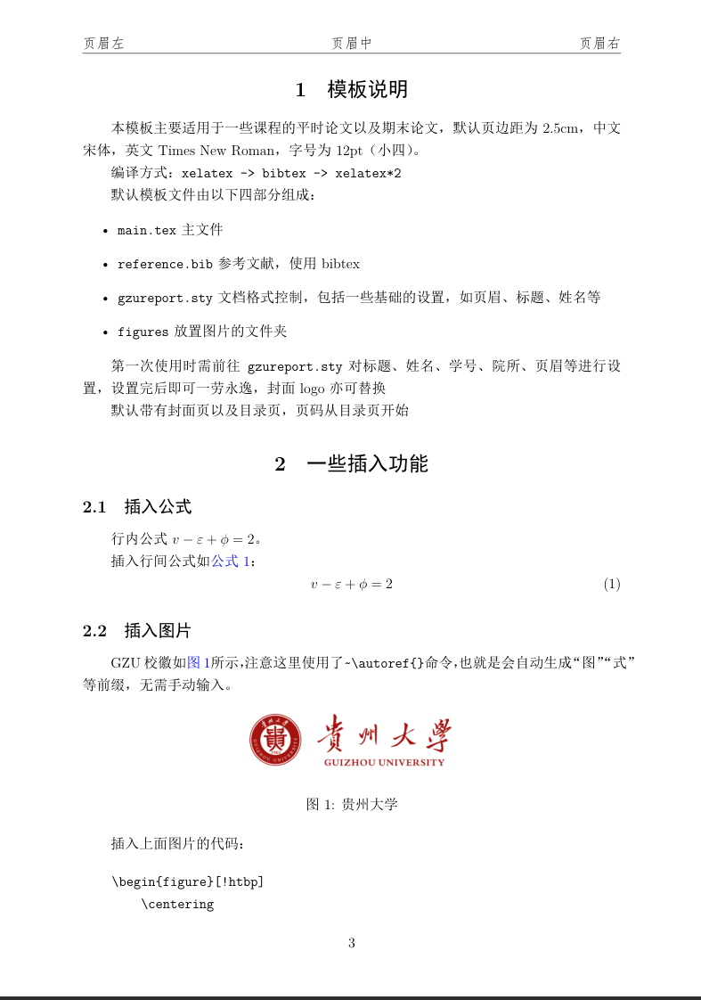

## 介绍
- 用于贵大(GZU)课程大作业/结课汇报的通用简易Latex模板

## 模板下载

[压缩包链接](https://github.com/0zero000zero0/gzu_report_template/releases/tag/v1.0)

OR

```bash
git clone https://github.com/0zero000zero0/gzu_report_template.git
```

## 使用方法
默认模板文件由以下四部分组成：

- `main.tex` 主文件,包含报告正文
- `reference.bib` 参考文献列表
- `gzureport.sty` 文档格式控制，包括一些基础的设置，可以设置页眉、标题、姓名等
- `figures` 放置图片的文件夹,包含院校LOGO和效果预览图

使用时需前往`gzureport.sty` 对标题、副标题、姓名、学号、院所、页眉等进行设置，然后编辑`main.tex`进行正文编写


|  [封面效果图](https://github.com/0zero000zero0/gzu_report_template/blob/master/figures/cover.png) |  [正文效果图](https://github.com/0zero000zero0/gzu_report_template/blob/master/figures/image.1.png)|
|:---:|:---:|
|  | |

## 参考

+ [GBT7714-2015标准下的BibTex样式](https://github.com/zepinglee/gbt7714-bibtex-style)
+ [国科大学位论文LaTeX模板](https://github.com/mohuangrui/ucasthesis)
+ [北京大学课程论文模板](https://www.overleaf.com/latex/templates/bei-jing-da-xue-ke-cheng-lun-wen-mo-ban/yntmqcktrzfh)

